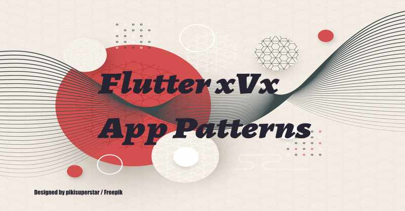

 
 
# Flutter XVX App Patterns

In declarative programming state management and app patterns tend to be the same thing somewhat so this combined to have both dependency injection, state events, and app pattern structure examples in one repo.Each app architecture demo has some basic unit tests included with the demo app.

## Articles 

I publish flutter articles on medium:

[Medium blog](https://fredgrott.medium.com)
